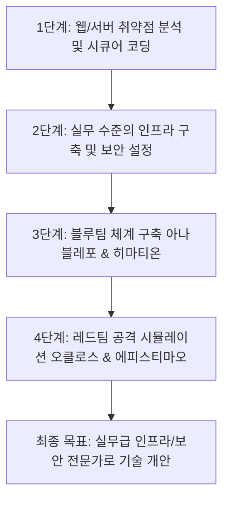

# Bartimaeus App - Ultimate Vision & Roadmap

사용자가 이 프로젝트를 통해 **실무적인 수준의 인프라 구축, 보안 위협 탐지/대응(블루팀), 모의 침투 및 침해 시뮬레이션(레드팀) 기술**을 전방위적으로 습득하는 것을 궁극적인 목표로 합니다.

성경 속 인물인 맹인 **바디매오(Bartimaeus)**의 이야기와 상징적 키워드를 바탕으로 프로젝트의 로드맵과 서브 시스템의 정체성을 정의합니다.

---

## 1. 보안 운영 및 시뮬레이션 시스템 네이밍

### 🔵 Blue Team (방어 & 분석)

#### **아나블레포 (Anablepo - '다시 보다/눈을 뜨다')**
*   **역할**: 최전방 탐지 및 식별 시스템 (SIEM, IDS/IPS, 로그 수집 및 실시간 대시보드 모니터링)
*   **의미**: 위협이 가득한 어둠 속에서 눈을 떠(開眼) 적의 공격을 가장 먼저 선명하게 포착하고 식별해내는 최전방 감시 체계.

#### **히마티온 (Himation - '겉옷')**
*   **역할**: 내부 패치, 엔드포인트 보안 강화(Hardening) 및 형상 관리 자동화 프로그램
*   **의미**: 바디매오가 예수를 향해 달려갈 때 방해가 되던 낡은 겉옷을 버려두었듯이, 시스템의 취약한 구형 코드를 벗어던지고 안전한 최신 패치로 시스템을 다시 감싸 보호하는 방어 체계.

---

### 🔴 Red Team (공격 & 침투 시뮬레이션)

#### **오클로스 (Ochlos - '대규모 무리/군중')**
*   **역할**: 대규모 분산 공격 시뮬레이터 및 다중 벡터 모의 침투 프레임워크
*   **의미**: 예수를 부르는 바디매오를 억누르고 가로막았던 수많은 무리(군중)처럼, 시스템이 임계치에 도달할 때까지 다각도로 압박하는 대규모 모의 공격 시스템.

#### **에피스티마오 (Epistimao - '잠잠하라고 꾸짖다/억누르다')**
*   **역할**: 서비스 거부(DoS) 공격 및 특정 타겟 기능 마비(Down) 시뮬레이션 도구
*   **의미**: 시끄럽게 소리 지르는 바디매오의 입을 틀어막고 조용히 시키려 했던 군중의 행동처럼, 대상 시스템의 특정 기능이나 전체 서비스를 일시적으로 침묵(마비) 상태로 만드는 도구.

---

## 2. 단계별 마스터 로드맵

### 📅 Phase 1: 애플리케이션 분석 및 시큐어 코딩 (현재 단계)
*   현재 구현된 C++ 백엔드 서버 및 프론트엔드의 취약점 진단 (예: CSRF, SQL Injection, OWASP Top 10 기준)
*   동적/정적 분석 도구를 활용한 코드 리뷰 및 리팩토링

### 📅 Phase 2: 전방위 인프라 구축 (Infrastructure Hardening)
*   Docker/Kubernetes 기반 컨테이너 환경 구축 및 네트워크 격리(VPC/Subnet 설계)
*   **서버 최전방 방어선(Reverse Proxy & WAF) 구축**: Nginx와 ModSecurity WAF(웹 애플리케이션 방화벽)를 연동하여 SQLi, XSS, 무차별 대입 및 대량 DoS 트래픽을 웹 서버 앞단에서 선제 차단하는 경계 보안 구현
*   SSL/TLS 인증서 자동 갱신 및 주요 정보통신기반시설 가이드라인 기반 OS/웹서버 설정 보안 적용

### 📅 Phase 3: 블루팀 구축 (Detection & Response)
*   **아나블레포**: ELK Stack 또는 Grafana Loki를 활용한 통합 로그 수집 및 보안 이벤트 탐지 룰 구현
*   **히마티온**: Ansible 또는 custom 스크립트를 활용해 취약한 인프라 및 코드를 자동으로 격리하고 패치하는 기능 개발

### 📅 Phase 4: 레드팀 침투 테스트 (Attack Simulation)
*   **오클로스**: 대규모 분산 트래픽 발생 장치 구현을 통한 서버 부하 및 가용성 테스트
*   **에피스티마오**: DoS 공격 패킷 생성 및 특정 API 레이트 리밋 우회 기법 등을 재현하여 실시간 탐지 체계 검증

---

## 3. 학습 및 수행 규칙
1.  **실무 정합성**: 모든 실습과 인프라 구성은 실제 현업에서 쓰이는 모범 사례(Best Practices)를 준수합니다.
2.  **문서화 유지**: 각 단계별로 취약점 리포트와 패치 내역을 히스토리로 기록하여 포트폴리오 수준으로 관리합니다.
3.  **안전 최우선**: 모든 레드팀 시뮬레이션 도구는 오직 격리된 로컬/테스트 인프라 환경 내에서만 작동하도록 안전장치를 마련합니다.
