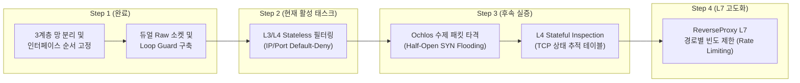

# 레드팀(Ochlos) vs 블루팀(Bartimaeus_app) 네트워크 아키텍처 및 상태 현황 보고서

본 문서는 **레드팀(공격자 C2 시뮬레이션: Ochlos)**과 **블루팀(다계층 보안 방어 웹 시스템: Bartimaeus_app)**의 네트워크 구성, 3계층 망 분리 토폴로지, 인터페이스 및 IP 할당 현황, 패킷 파이프라인 및 현재까지의 공격 실증 상태를 총괄 정리한 엔지니어링 문서입니다.

---

## 1. 네트워크 설계 개요 (Network Architecture Overview)

```
[ 레드팀: Ochlos ]
   (공격자 컨테이너)
          │ (Raw Socket / IP Spoofing / SYN Flooding)
          ▼
┌─────────────────────────────────────────────────────────────────────────┐
│ 블루팀: 1_external_net (외부 비신뢰 네트워크: 172.22.0.0/16 대역)         │
│  - 호스트 공개 진입점: 0.0.0.0:8080                                      │
└────────────────────────────────────┬────────────────────────────────────┘
                                     │ eth0 (172.22.0.2)
                     ┌───────────────┴───────────────┐
                     │   bartimaeus-screening-router │ (L3/L4 Dual-Homed Gateway)
                     │    - AF_PACKET + SOCK_DGRAM   │ - Loop Guard 적용
                     │    - poll() I/O Multiplexing  │ - eth0 ↔ eth1 대칭 포워딩
                     └───────────────┬───────────────┘
                                     │ eth1 (172.25.0.3)
┌────────────────────────────────────┴────────────────────────────────────┐
│ 블루팀: 2_dmz_net (DMZ 완충 네트워크: 172.25.0.0/16 대역)                │
│  - 외부 직접 접근 불가 / 방화벽 우회 차단                                   │
└────────────────────────────────────┬────────────────────────────────────┘
                                     │ eth0
                     ┌───────────────┴───────────────┐
                     │   bartimaeus-reverse-proxy    │ (L7 Application Gateway)
                     │    - TCP 세션 종단/중계        │ - Listen: 0.0.0.0:8080
                     │    - 4KB Paged Streaming      │ - Multi-threaded Relay
                     └───────────────┬───────────────┘
                                     │ eth1
┌────────────────────────────────────┴────────────────────────────────────┐
│ 블루팀: 3_internal_net (내부 격리 사설 네트워크)                          │
│  - 외부 인터넷 완전 차단 / 인가된 프록시 트래픽만 수신                    │
└───────────────┬─────────────────────────────────────────┬───────────────┘
                │ eth0 (Port 9090)                        │ eth0 (Port 3306)
 ┌──────────────┴──────────────┐           ┌──────────────┴──────────────┐
 │       bartimaeus-app        │           │      bartimaeus-mariadb     │
 │  - SecureWebServer (C++20)  │◀─────────▶│  - MariaDB 11.4             │
 │  - cgroups mem_limit: 2GB   │ (DB Pool) │  - Connection Pool 타깃     │
 └─────────────────────────────┘           └─────────────────────────────┘
```

### 1.1 핵심 보안 설계 원칙
1. **3계층 망 분리 (3-Tier Network Segmentation)**:
   - 외부망(`1_external_net`), 완충망(`2_dmz_net`), 사설망(`3_internal_net`)의 3개 독립 브릿지 네트워크로 완전 구획.
2. **단일 진입로 및 방화벽 우회 원천 차단 (Sole Inbound Entry Point)**:
   - 외부 포트 포워딩(`8080:8080`)은 오직 최전방 `bartimaeus-screening-router`에만 단독 바인딩.
   - `reverse-proxy` 및 백엔드 `app`의 외부 포트 매핑을 완전 제거하여 방화벽 우회(Bypass) 경로를 물리적으로 차단.
3. **듀얼 홈 게이트웨이 모델 (Dual-Homed Gateway)**:
   - `ScreeningRouter`: `1_external_net`(외부)과 `2_dmz_net`(DMZ)을 양팔로 연결.
   - `ReverseProxy`: `2_dmz_net`(DMZ)과 `3_internal_net`(내부망)을 양팔로 연결.
   - 각 계층 간의 패킷/스트림은 전용 중계 엔진을 반드시 거쳐야만 다음 망으로 전이 가능.

---

## 2. 가상 네트워크 및 인터페이스 할당 현황

### 2.1 Docker 가상 네트워크 정의

| 네트워크 이름 | 드라이버 | 역할 및 구획 영역 | 비고 |
| :--- | :--- | :--- | :--- |
| **`1_external_net`** | `bridge` | 외부 인바운드 트래픽 수신 및 레드팀(Ochlos) 접속 영역 | Docker 엔진 알파벳 정렬로 `eth0` 할당 고정 |
| **`2_dmz_net`** | `bridge` | Screening Router와 Reverse Proxy 간의 완충망 (DMZ) | Docker 엔진 알파벳 정렬로 `eth1` 할당 고정 |
| **`3_internal_net`** | `bridge` | Reverse Proxy, 백엔드 App, MariaDB 간의 안전한 내부망 | 외부 노출 금지된 비공개 사설망 |

> [!NOTE]
> **인터페이스 결정론적 할당 (Deterministic Interface Ordering)**:
> Docker 엔진은 컨테이너에 다중 네트워크를 연결할 때 네트워크 이름의 알파벳 순서대로 인터페이스 번호를 부여합니다. 따라서 접두사 `1_`, `2_`, `3_` 네이밍을 통해 `ScreeningRouter`의 인터페이스가 언제나 `eth0(1_external_net)`, `eth1(2_dmz_net)`로 고정되도록 영구 보장하였습니다.

### 2.2 컨테이너별 네트워크 인터페이스 및 바인딩 상태

| 팀 구분 | 컨테이너 명칭 | 소속 네트워크 | 내부 인터페이스 및 IP | 노출 포트 | 권한 및 보안 설정 |
| :---: | :--- | :--- | :--- | :---: | :--- |
| **레드팀** | `ochlos-attacker` | `1_external_net` (`external: true`) | `eth0`: 동적 IP (외부망 참여) | None | `CAP_NET_RAW`, `CAP_NET_ADMIN` (저수준 패킷 주입) |
| **블루팀** | `bartimaeus-screening-router` | `1_external_net`<br>`2_dmz_net` | `eth0`: `172.22.0.2` (External)<br>`eth1`: `172.25.0.3` (DMZ) | `8080:8080` (호스트 인입 단독 진입점) | `CAP_NET_ADMIN`, `CAP_NET_RAW` (L3/L4 Raw Socket) |
| **블루팀** | `bartimaeus-reverse-proxy` | `2_dmz_net`<br>`3_internal_net` | `eth0`: DMZ 대역 IP<br>`eth1`: 내부망 대역 IP | 내부 `8080` | 호스트 외부 포트 제거 (DMZ 완충 격리) |
| **블루팀** | `bartimaeus-app` | `3_internal_net` | `eth0`: 내부망 대역 IP | 내부 `9090` | 호스트 외부 포트 제거, `mem_limit: 2g` |
| **블루팀** | `bartimaeus-mariadb` | `3_internal_net` | `eth0`: 내부망 대역 IP | `3306:3306` (개발 조회용) | 내부망 한정 애플리케이션 통신 |

---

## 3. 레드팀 (Ochlos) 인프라 및 공격 능력

### 3.1 프로젝트 정체성 및 격리 인프라
* **목적**: Windows 호스트 OS 커널의 Raw Socket/IP Spoofing 보안 제약을 극복하고, Linux Docker 컨테이너 환경에서 L3~L7 공격 도구를 직접 제작하여 블루팀 방어선을 선행 타격(Offensive-First).
* **기반 OS/도구**: Ubuntu 24.04 컨테이너, `g++` (C++20), `cmake`, `iproute2`, `net-tools`, `iputils-ping`, `tcpdump`.
* **On-demand 실행기 (`cpprun`)**:
  ```bash
  docker compose run --rm ochlos cpprun DoS/icmp_echo_flooding.cpp
  ```
  타격 시에만 즉석 생성되어 컴파일/실행 후 컨테이너를 자동 소멸(`--rm`)시켜 호스트 머신의 소켓 고갈 및 리소스 안정을 보장.

### 3.2 구현 완료 및 운용 중인 공격 도구 현황

| 공격 도구 소스 | 대상 계층 (OSI) | 공격 메커니즘 | 블루팀 대응 방어선 |
| :--- | :---: | :--- | :--- |
| **`DoS/icmp_echo_flooding.cpp`** | **L3 (Network)** | L3 Raw Socket(`IP_HDRINCL`)을 사용해 출발지 IP를 `100.0.0.99` 등으로 위조(IP Spoofing) 후 ICMP Echo Request 대량 방출 | `ScreeningRouter` eth0 ICMP 감지 및 DMZ 패킷 누출 차단 |
| **`DoS/tcp_syn_flooding.cpp`** | **L4 (Transport)** | 3-Way Handshake 완료 후 RST/FIN 없이 소켓 배열에 장기 보관하여 연결 풀 및 대기열 고갈 유도 (Connection Starvation) | `ReverseProxy` 세션 분리 및 `ScreeningRouter` 접속 감지 |
| **`DoS/raw_tcp_syn_flooding.cpp`** | **L3/L4 (Transport)** | Handshake를 완료하지 않는 비정상 Half-Open SYN 패킷 직접 조작 및 주입 (Backlog Queue 고갈) | `ScreeningRouter` Stateful Inspection (예정) |
| **`include/ochlos_net.hpp`** | **L3/L4 공통** | 1바이트 패킹(`#pragma pack(push, 1)`) IPv4(20B) + TCP(20B) 헤더 구조체 및 의조 헤더(Pseudo-header) 체크섬(RFC 791/793) 라이브러리 | 바이너리 정렬 검증 완료 |

---

## 4. 블루팀 (Bartimaeus_app) 다계층 방어 파이프라인

### 4.1 L3/L4 최전방: ScreeningRouter
* **소켓 아키텍처**:
  - `ext_sock`: `socket(AF_PACKET, SOCK_DGRAM, htons(ETH_P_IP))` ➔ `eth0` 인터페이스 바인딩.
  - `dmz_sock`: `socket(AF_PACKET, SOCK_DGRAM, htons(ETH_P_IP))` ➔ `eth1` 인터페이스 바인딩.
  - `SOCK_DGRAM`을 채택하여 L2 Ethernet 헤더(14바이트) 파싱 오버헤드를 배제하고 순수 L3 IP 패킷부터 직접 제어.
* **I/O 멀티플렉싱 (`poll`)**:
  - `struct pollfd fds[2]`로 `ext_sock`와 `dmz_sock`의 `POLLIN` 이벤트를 단일 스레드 논블로킹 감시.
* **루프 가드 및 무한 반사 방지 (Loop Guard)**:
  1. `PACKET_OUTGOING` 필터링: 자신이 다른 소켓으로 송출한 패킷이 자기 수신 큐로 되돌아오는 현상 즉시 무시.
  2. 로컬 목적지 반사 차단: DMZ(`eth1`)에서 되돌아오는 응답 패킷 중 목적지 IP가 라우터 자신의 외부 IP(`172.22.0.2`)인 패킷을 드롭하여 브로드캐스트/반사 루프 원천 방지.
* **실시간 가시성 확보**:
  - `std::unitbuf` 설정으로 버퍼 지연 없이 커널 `write()` 시스템 콜을 즉시 유발하여 실시간 인바운드/아웃바운드 패킷 로깅(`[L3 Inbound]`, `[L3 Outbound]`).

### 4.2 L7 완충 게이트웨이: ReverseProxy
* **스트림 파이프라인**:
  - DMZ 내부(`0.0.0.0:8080`)에서 외부 요청 대기 (`accept`).
  - 클라이언트 인입 시 `std::thread`를 생성하여 백엔드(`app:9090`, 내부망 DNS 해석)로 4KB I/O 버퍼 스트림 양방향 중계(`forward_stream`).
  - 한쪽 스트림 종료 시 `SHUT_WR` 시스템 콜로 안전하게 TCP 하프 클로즈를 수행하여 데드락 예방.
* **보안 격리 효과**:
  - 외부 클라이언트는 백엔드 WebServer의 IP나 포트를 직접 알 수 없으며, TCP 세션이 ReverseProxy에서 1차 종단되므로 백엔드 직접 타격 불가.

### 4.3 L7 코어 백엔드: SecureWebServer & MariaDB
* **격리 환경**: `3_internal_net` 사설망 내부에서만 통신.
* **리소스 통제**: Docker `cgroups` 기반 `mem_limit: 2g` 할당으로 호스트 메모리 고갈 방어.
* **구현된 보안 메커니즘**:
  - SQL Injection 방어: MySQL C API Prepared Statements (`mysql_stmt_bind_param`).
  - 세션 하이재킹 방어: OpenSSL CSPRNG `RAND_bytes` 기반 256비트 엔트로피 세션 토큰 + `HttpOnly`/`Secure`.
  - Stored XSS 방어: `escapeJson` + C++ 레벨 `htmlEscape` 이중 인코딩.
  - 자동화 공격 방어: `LoginLimiter` 메모리 기반 실패 카운팅 및 429 Too Many Requests 선제 차단.
  - DoS 자원 고갈 방어: 10초 주기 백그라운드 활성 가비지 컬렉터(`std::jthread`).

---

## 5. 트래픽 흐름 및 패킷 경로 상세

### 5.1 정상 인바운드 HTTP 통신 흐름
```
1. 클라이언트 요청 
   ➔ 호스트 0.0.0.0:8080 (호스트 포트)
   ➔ bartimaeus-screening-router: eth0 (172.22.0.2:8080)
   ➔ ext_sock [L3 Inbound 감지 및 로깅]
   ➔ sendto(dmz_sock)로 포워딩
   ➔ bartimaeus-reverse-proxy: eth0 (2_dmz_net:8080)
   ➔ accept() 및 세션 종단 ➔ forward_stream 스레드 기동
   ➔ 백엔드 연결: app:9090 (3_internal_net)
   ➔ bartimaeus-app (SecureWebServer) 요청 처리 및 DB 커넥션 풀 쿼리 (3306)
   ➔ 역방향 응답: app ➔ reverse-proxy ➔ screening-router(eth1) ➔ Loop Guard 통과 ➔ screening-router(eth0) ➔ 클라이언트
```

### 5.2 레드팀(Ochlos) 공격 트래픽 경로 및 격리
```
1. ochlos-attacker 컨테이너 기동 (CAP_NET_RAW)
2. 1_external_net 가상 브릿지를 통해 수제 패킷 주입
   (예: L3 Spoofed IP: 100.0.0.99 ➔ 172.22.0.2:8080)
3. screening-router의 eth0(ext_sock)에서 L3 패킷 직접 수신
   - 출력: [L3 Inbound] 100.0.0.99 -> 172.22.0.2 (Proto: 1)
4. 차단 검증:
   - ICMP 등 비인가 트래픽은 dmz_net 및 reverse-proxy로 누출되지 않고 경계선에서 소멸.
   - 외부 공격자가 DMZ(2_dmz_net) 또는 내부망(3_internal_net)의 IP 대역을 직접 스캔하거나 스푸핑 패킷을 주입하는 것이 네트워크 브릿지 차원에서 원천 차단됨.
```

---

## 6. 공격 실증 이력 및 현재 네트워크 방어 상태

| 시나리오 ID | 공격 명칭 | 대상 계층 | 실증 결과 및 현황 | 방어 상태 |
| :--- | :--- | :---: | :--- | :---: |
| **SCENARIO-01** | **L4 TCP Connection Starvation** | Layer 4 | Ochlos에서 50개 커넥션 인입 시 ScreeningRouter에서 출발지 IP/Port 실시간 50건 연속 감지 확인 | **가시성 확보 완료** |
| **SCENARIO-02** | **L3 ICMP Echo Flooding & IP Spoofing** | Layer 3 | 출발지 위조(`100.0.0.99`) 100건 방출. ScreeningRouter `eth0`에서 100건 전수 실시간 탐지 완료. DMZ(`eth1`) 및 ReverseProxy로의 누출 0건 입증 | **경계선 격리 검증 완료** |
| **ING-PIPE** | **대칭형 듀얼 소켓 포워딩 파이프라인** | Layer 3/4 | `1_external_net`/`2_dmz_net` 정렬 네이밍 고정, `AF_PACKET` + `poll()` 기반 `eth0` ↔ `eth1` 양방향 패킷 패스스루 및 Loop Guard 동작 확인 | **구축 완료** |

---

## 7. 향후 로드맵 및 다음 과제



1. **Screening Router Stateless 필터링 구현 ([TODO.md](TODO.md) ②)**:
   - 화이트리스트/블랙리스트 기반 IP 필터링 규칙 엔진 탑재.
   - 비인가 포트 및 프로토콜(ICMP 무차별 인입 등) 즉시 Drop 로직 추가.
2. **Ochlos Half-Open SYN Flooding 실증 ([TODO.md](TODO.md) ③)**:
   - `raw_tcp_syn_flooding.cpp`를 활용하여 Stateless 필터링의 한계(SYN 플래그만 달고 오는 대량 Half-Open 패킷에 의한 백로그 큐 소진)를 레드팀 관점에서 선행 증명.
3. **Stateful Inspection (상태 기반 패킷 검사) 도입 ([TODO.md](TODO.md) ④)**:
   - 3-Way Handshake 세션 테이블을 메모리에 유지하여 정상 상태 전이(SYN ➔ SYN/ACK ➔ ACK)를 따르는 패킷만 통과시키는 상태 추적 엔진 구축.

---

## 8. 📝 KISA 기술직 및 정보보안기사 시험 연계 포인트

* **방화벽 구축 형태 (Firewall Architectures)**:
  - **Screening Router (스크리닝 라우터)**: OSI 3계층(IP) 및 4계층(TCP/UDP) 헤더 정보(출발지/목적지 IP, 포트, 프로토콜)만을 참조하여 패킷을 필터링하는 Stateless 방화벽. 속도가 빠르지만 페이로드 검사 불가 및 IP Spoofing/Half-Open 공격에 취약.
  - **Dual-Homed Gateway (이중 홈 게이트웨이)**: 2개 이상의 서로 다른 네트워크 인터페이스를 장착하여 외부망과 내부망을 물리적/논리적으로 분리하고 라우팅 기능을 끈 채 프록시 소프트웨어를 통해서만 트래픽을 중계하는 구조.
  - **Screened Subnet Gateway (스크린드 서브넷 게이트웨이)**: 외부 스크리닝 라우터와 내부 스크리닝 라우터 사이에 DMZ(완충 영역)를 배치하여 3중 방어선을 형성하는 실무 표준 아키텍처 (현재 Bartimaeus가 채택한 구조의 모태).
* **Linux 소켓 계층 구조 (`AF_PACKET` vs `AF_INET`)**:
  - `AF_INET`: OS 커널의 TCP/IP 네트워크 스택을 경유하며 L4 상위(TCP/UDP) 페이로드만 유저 공간으로 전달.
  - `AF_PACKET` + `SOCK_DGRAM`: Data Link 계층(L2)에서 디바이스 드라이버로부터 직접 L3 패킷을 가로채며, Ethernet 헤더는 커널이 벗겨내고 순수 IP 패킷부터 유저 공간에 제공 (`sll_ifindex`로 인터페이스 바인딩).
* **KISA 주요정보통신기반시설 기술적 취약점 분석·평가 기준**:
  - **보안장비 점검항목 S-05 (보안 정책 관리)**: 기본 정책(Default Policy)을 'Default Deny(명시적으로 허용되지 않은 모든 접근 거부)'로 설정하고 비인가 서비스 포트 차단 여부를 점검.
  - **S-14 (로그 관리)**: 시스템 침해사고 분석을 위한 방화벽 인바운드/아웃바운드 패킷 실시간 로깅 및 감사 추적성 확보.
